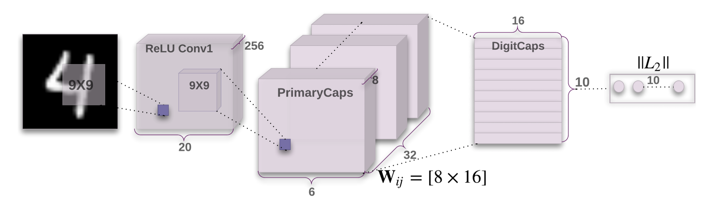

# Capsnet
Pytorch implemented Capsnet referenced to Dynamic Routing Between Capsules. You can find the paper [here](https://arxiv.org/pdf/1710.09829.pdf)

### Two new improvement compared to the traditional cnn
#### Dynamic routing system
#### Activation scalar to vecter
